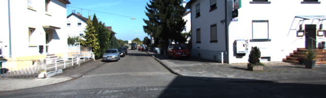
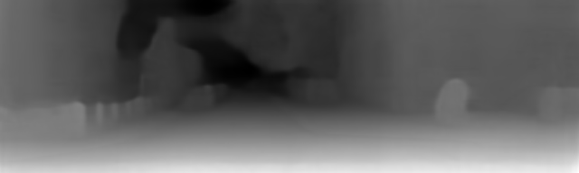
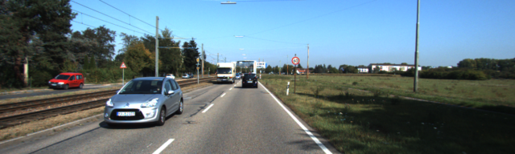
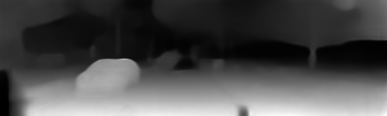

# monodepth2-from-scratch

This my simplified re-implementation of monodepth2 in pytorch

Monodepth2 is self-supervised depth estimation network.

This model was trained on Kitti-raw dataset. I used Eigen split used by Zhou et.al.

## Dataset format

Root  
├───2011_09_26  
│   ├───2011_09_26_drive_0001_sync   
│   │   ├───image_02  
│   │   │   └───data  
│   │   ├───image_03  
│   │   │   └───data  
.  
.  
│   ├───2011_10_03_drive_0058_sync      
│   │   ├───image_02  
│   │   │   └───data  
│   │   ├───image_03  
│   │   │   └───data 

# Results
1.
<p align="center">
  
</p>
<p align="center">
  
</p>

2.
<p align="center">
  
</p>
<p align="center">
  
</p>


# Original authors and paper:
```
@article{monodepth2,
  title     = {Digging into Self-Supervised Monocular Depth Prediction},
  author    = {Cl{\'{e}}ment Godard and
               Oisin {Mac Aodha} and
               Michael Firman and
               Gabriel J. Brostow},
  booktitle = {The International Conference on Computer Vision (ICCV)},
  month = {October},
year = {2019}
}
```

# Credits
> **Digging into Self-Supervised Monocular Depth Prediction**
>
> [Clément Godard](http://www0.cs.ucl.ac.uk/staff/C.Godard/), [Oisin Mac Aodha](http://vision.caltech.edu/~macaodha/), [Michael Firman](http://www.michaelfirman.co.uk) and [Gabriel J. Brostow](http://www0.cs.ucl.ac.uk/staff/g.brostow/)
>
> [ICCV 2019 (arXiv pdf)](https://arxiv.org/abs/1806.01260)
